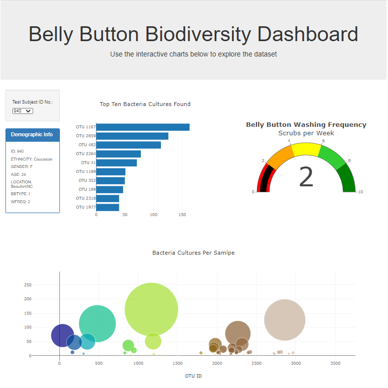
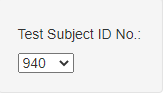
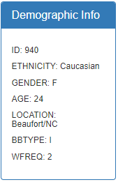
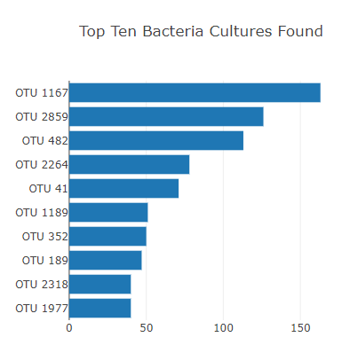
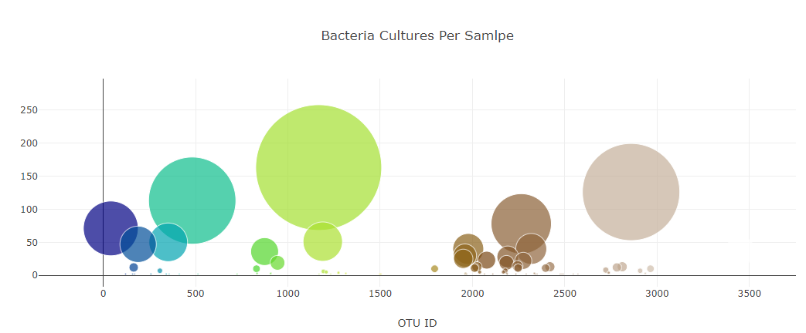
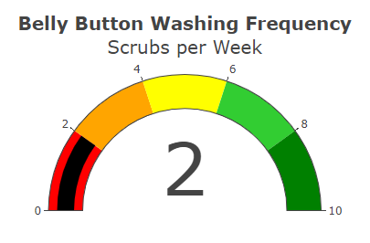

# Plotly_Belly_Button_Biodiversity
This challenge subject matter was in regard to the Biodiversity in a belly button sample that was collected across variety of individuals. Plotly was utilized to create the visualization while the data manipulation was done through JavaScript, D3, JSON and HTML.

## The Project
Here are the highlights of the project...
1. The data was created from a given JSON file and read in using JavaScript.
2. A dashboard was created with the aid of Plotly, JavaScript and HTML.

Dashboard of Project

3. Created a user interface for the user to select their unique identification number from a dropdown menu.

4. Created a panel to display the metadata for the selected ID. Within the metadata the BBTYPE field reffers to the belly button type Innie (I) or Outie (O). the WFREQ is the wash frequency of the belly button.

5. built a horizontal bar chart to display the top 10 bacteria cultures found.

6. A bubble chart was generated to hold the bacteria cultures per sample.

7. Finally, a gauge chart was created to display the wash frequency.

8. The completed project was deployed into github pages and can be viewed at [My GitHub Page](https://lasithal.github.io/Plotly_Belly_Button_Biodiversity/)
